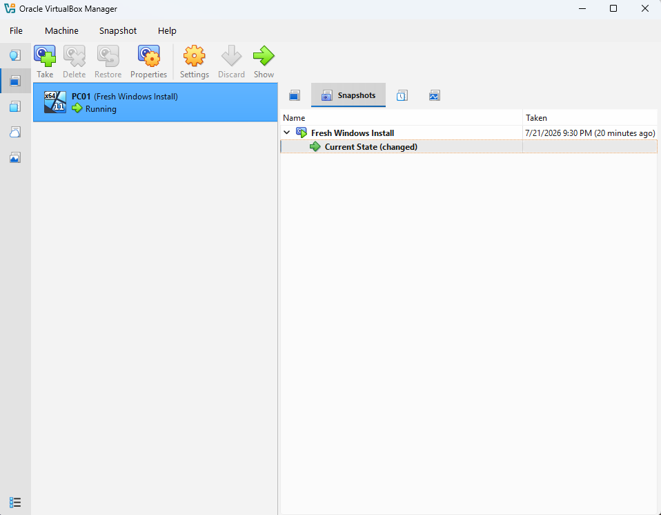

# 1. Windows 11 Virtual Machine Setup

## Overview
Configured a Windows 11 Pro virtual machine using Oracle VirtualBox as the foundation for future Windows adminstration and infrastructure projects.

## Environment
- Host OS: Windows 11 Pro
- Virtualization Platform: Oracle VirtualBox
- Guest OS: Windows 11 Pro
- Hardware Virtualization: AMD-V enabled
  
## Configuration
Completed the following:
- Installed Oracle VirtualBox
- Created a Windows 11 virtual machine
- Configured VM hardware settings
- Installed Windows 11 Pro
- Installed VirtualBox Guest Additions
- Created an initial VM snapshot

## Troubleshooting

### Issue 1: AMD-V Virtualization Disabled
During initial setup, VirtualBox displayed an error indicating that hardware virtualization was unavailable.

### Resolution:
Enabled SVM Mode (AMD virtualization) in the BIOS settings and restarted the system.

## Concepts Learned
### Virtualization and Hypervisors
Virtualization allows multiple operating systems to run on a single physical machine by sharing hardware resources through a hypervisor.

Oracle VirtualBox was used as a Type 2 hypervisor, running on top of the host operating system to create and manage the Windows 11 virtual machine.

### Virtual Machine Resources
The virtual machine was configured with allocated memory, processors, and virtual storage.

Resource allocation affects virtual machine performance because the guest operating system shares physical hardware resources with the host system.

### Hardware Virtualization
VirtualBox initially failed to start the virtual machine because AMD-V virtualization support was disabled.

SVM Mode (Secure Virtual Machine) was enabled in BIOS to allow the processor's virtualization features to be used by the hypervisor.

### Snapshots and Recovery
A snapshot was created after completing the initial Windows setup.

Snapshots provide a restore point that allows changes to be reversed before making additional system configurations.

## Screenshots
### Virtual Machine Configuration

### Windows Installation

### Snapshot Creation

