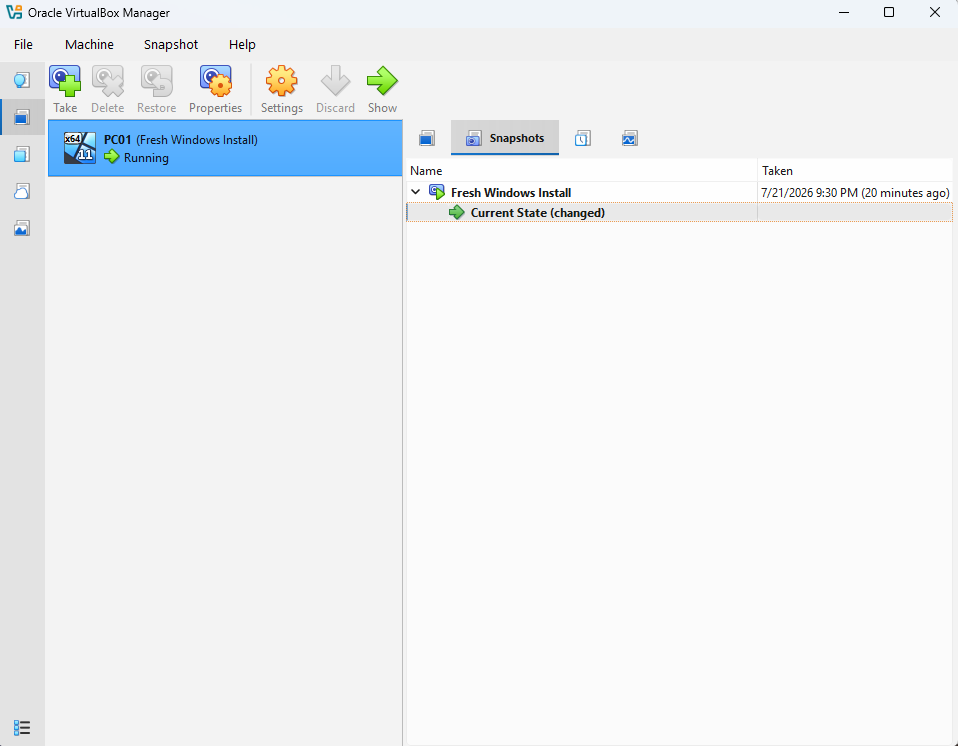

# 1. Windows 11 Virtual Machine Setup

## Overview
Configured a Windows 11 Pro virtual machine using Oracle VirtualBox to establish the initial environment for future Windows administration, infrastructure, and security projects.

The virtual machine provides an isolated system where administrative configurations, troubleshooting procedures, scripts, and security changes can be tested without affecting the host operating system.

## Environment
- Host OS: Windows 11 Pro
- Virtualization platform: Oracle VirtualBox
- Guest OS: Windows 11 Pro
- Hardware Virtualization: AMD-V
- BIOS configuration: SVM Mode enabled
  
## Configuration
### Virtual Machine Creation
Created a new virtual machine in Oracle VirtualBox and configured the guest operating system as Windows 11 Pro.

Virtual hardware resources were allocated for:
- system memory
- virtual processors
- virtual storage
- display settings
- windows installation media

### Windows Installation
Installed Windows 11 Pro instide the virtual machine and completed the initial operating system configuration.

### Guest Additions
Installed Oracle VirtualBox Guest Additions to improve integration between the host and guest operating systems. 

### Snapshot Creation
Created an initial snapshot after completing the Windows installation and base virtual machine configuration.

## Troubleshooting

### AMD-V Virtualization Unavailable
**Issue:** During initial setup, VirtualBox displayed an error indicating that hardware virtualization was unavailable. The virtual machine could not start because the processor's virtualization features were disabled in the system firmware settings.

**Resolution:** Enabled SVM Mode (AMD virtualization) in the BIOS settings and restarted the host computer. After the change, VirtualBox successfully detected AMD-V support and the Windows 11 virtual machine started normally

## Concepts Learned
### Virtualization and Hypervisors
Virtualization allows multiple operating systems to run on a single physical machine by sharing the host system's hardware resources to virtual machines.

Oracle VirtualBoxfunctions as a Type 2 hypervisor because it runs on top of the host operating system.

### Host and Guest Operating Systems
The host operating system is the operating system installed directly on the physical computer. The guest operating system runs inside the virtual machine.

### Virtual Machine Resource Allocation
A virtual machine uses resources assigned from the physical host, including CPU, memory, and storage.

Allocating too few resources can reduce guest operating system performance. Allocating too many resources can negatively affect the host operating system. Resource allocation requires balancing the needs of the guest OS with the available capacity of the host computer.

## Guest Additions
Guest Additions installs drivers and utilities inside the guest OS. It provides functionality such as automatic screen resizing and mouse pointer integration.

### Hardware Virtualization
AMD-V provides processor level virtualization support on compatible AMD processors.

VirtualBox requires access to these processor features to run supported guest operating systems efficiently. On this system, AMD-V was controlled through the BIOS setting called SVM Mode.

### Snapshots and Recovery
A snapshot records the state of a virtual machine at a specific point in time.

The snapshot provides a known working state that can be restored if a future administrative change, software installation, or configuration causes a problem.

## Screenshots
### Virtual Machine Configuration

### Windows Installation

### Snapshot Creation

