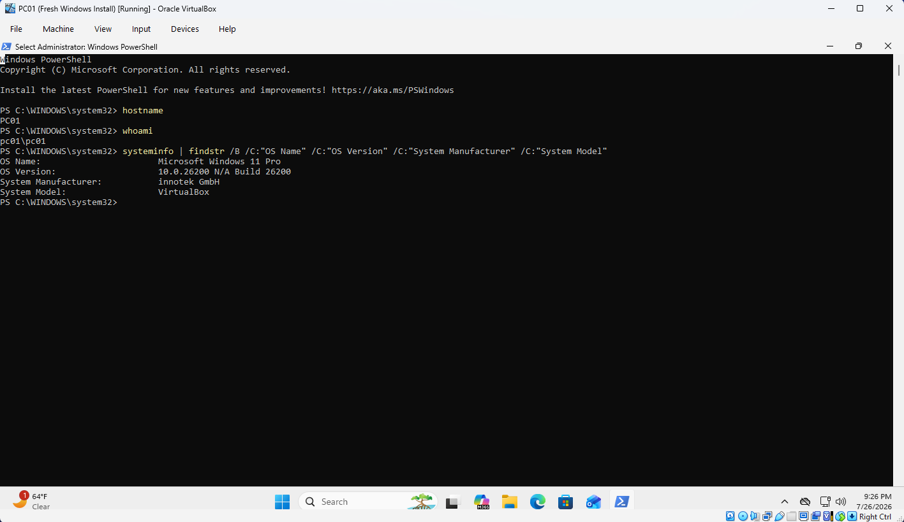
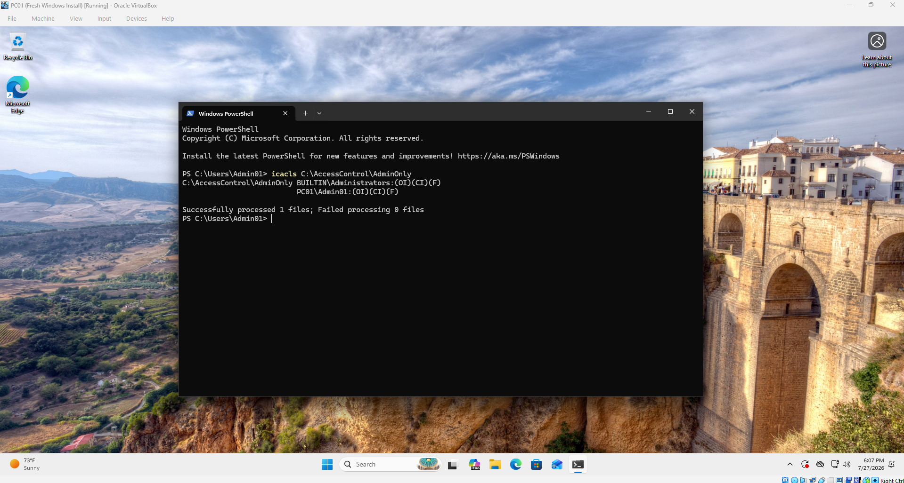
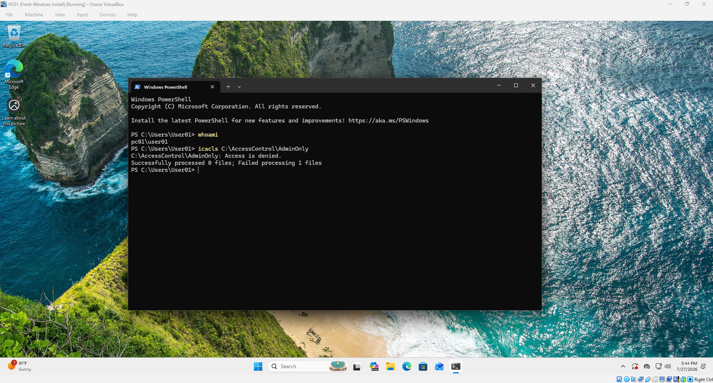

# Windows Workstation Administration

## Overview
Configured and administered a Windows 11 virtual workstation to practice foundational Windows administration tasks.

The workstation was renamed using a consistent naming convention and configured with separate administrator and standard user accounts.

## Environment

- Host OS: Windows 11 Pro
- VM Platform: Oracle VirtualBox
- GuestOS: Windows 11 Pro
- Workstation Name: PC01

## Configuration
### Workstation Naming
The default computer name was changed to `PC01` to establish a consistent workstation naming convention. 

The `hostname` command was used to display the current computer name assigned to the system.

The `whoami` command was used to identify the current logged-in user account.

The `systeminfo` command was used to collect detailed system information, including the operating system, version, and virtualization environment. It was also used to verify that the workstation was running Windows 11 Pro and hosted within Oracle VirtualBox. 

**Example**

 `systeminfo | findstr /B /C:"OS Name" /C:"OS Version" /C:"System Manufacturer" /C:"System Model"`
- `findstr` filters command output by searching for specific text
- `/B` filters results that begin with the specified text
- `/C` searches for an exact phrase

### Local User Account Management
Created local accounts to simlulate different workstation access roles. The process included creating new user accounts, assigning users to appropriate lcoal groups, and removing unncessary accounts from the workstation.

**Configured accounts:**
- **Admin01**: dedicated administrator account
- **User01:** standard user account
- **User02:** standard user account

**Admin01** was added to the local **Adminstrators** group.
**User01** and **User02** were added to the local **Users** group.

**Commands:**
- `New-LocalUser` creates new local user accounts
- `Add-LocalGroupMember` assigns uers to local groups
- `Remove-LocalUser` removes unused local accounts

### NTFS File and Folder Permissions
Created test folders to test access control between administrator and standard user accounts. Configured permissions using the Security tab in folder properties. The `icacls` command was used to view assigned NTFS permissions and verify access settings.

### Windows Event Logging
Used Event Viewer to review Security logs generated by successful and failed sign-in attempts. Filtered the Security log for Event IDs 4624 and 4625, then matched the events using the account name, timestamp, and logon type.

### Windows Service Management
Reviewed the Printer Spooler service using the Services console and PowerShell. 

In PowerShell, `Get-Service` was used to verify that its status changed from Running to Stopped and back to Running. `Stop-Service` to stop it and `Start-Service` to start it again.

Verified that the service changed from Running to Stopped and then returned to Running.

### Windows Storage Management
Used Disk Management to create and attach a 2GB fixed VHDX to the Windows 11 virtual machine. Initialized the disk using GPT, created a simple volume, formatted it with NTFS, and assigned the drive letter E:. Verified the completed LabStorage volume through Disk Management, File Explorer, Get-Disk, and Get-Volume.

### Windows Defender Firewall
Reviewed the Domain, Private, and Public firewall profiles through Windows Defender Firewall with Advanced Security and PowerShell. Used `Get-NetConnectionProfile` to confirm that the vm was connected through the Public network profile. Created an inbound firewall rule that allowed ICMPv4 echo requests on the Public profile. Used `Get-NetFirewallRule` to verify the rule, then used `Disable-NetFirewallRule` to change its status. Removed the test rule after completing the configuration and verification process using `Remove-NetFirewallRule`.

Created an inbound

## Troubleshooting
### Computer Rename Access Denied
**Issue:** The computer rename command returned an "Access Denied" error.

**Cause:** The rename command was attempted from a Windows Terminal without elevated administrative privileges.

**Solution:** Terminal was reopened with administrator privileges and the computer rename command was completed successfully.

### Service Management Permission Error
**Issue:** When attempting to stop the Printer Spooler service with PowerShell using `Stop-Service`, the command returned an access-related error.

**Cause:** The Windows Terminal was not opened as administrator.

**Solution:** Terminal was reopened as administrator and the Printer Spooler service was successfully stopped.

### Blocked Script
**Issue & Cause:** PowerShell blocked the script from running in terminal due to the system execution policy.

**Solution**: A Process-scoped bypass was used to allow the script to run temporarily without changing the machine-wide policy. `Set-ExecutionPolicy -Scope Process -ExecutionPolicy Bypass`

## Concepts Learned
### Local Users and Groups
Windows uses local groups to organize user permissions and privilges. Assigning users to appropriate groups provides a structured method for managing access. Local accounts can be created, modified, and removed. 

### Group-Based Access Control
Windows manages permissions through a combiniation of user accounts, groups, and assigned permissions. Built-in local groups, such as Administrators and Users, already have predefined permission levels. Permissions are typically assigned to groups rather than individual users. For example, Admin01 was added to the local Administrators group. The Administrators group already has administrative privileges, so Admin01 inherited those permissions. 

### NTFS File and Folder Permissions
NTFS refers to New Technology File System which is the file system Windows uses for modern drives. NTFS permissions control access to files and folders on Windows systems. Permissions can be inherited by files and subfolders inside a directory. 

Permission flags shown by `icacls` include:
- `(F)` Full Control: grants complete access including modifying files, deleting files, and changing permissions
- `(OI)` Object Inherit: applies permissions to files inside the folder
- `(CI)` Container Inherit: apples permissions to subfolders inside the folder

### Windows Authentication Events
Windows records security events for authentication activities.

Event IDs:
- Event ID 4624 represents a successful logon.
- Event ID 4625 represents a failed logon.

The logon type identifies how the sign-in occured. Logon Type 2 represents an interactive sign-in performed directly at the workstation. The Event ID can be used as an anchor, while the timestamp, account name, and logon type help identify the specific sign-in being investigated.

### Windows Services
Windows services are background processes that support operating system features and applications. Service status can be checked before and after a change to confirm whether an administrative action succeeded.

Administrative privileges are required to modify many system services.

### Windows Storage
A new disk must be initialized and configured before Windows can use it for file storage. A VHDX is a virtual hard disk file that Windows can attach and manage like a physical disk. The VHDX provided a safe way to practice adding and configuring storage without modifying the VM's main system disk. 

GPT defines the disk's partition structure, while a volume represents usable storage created from the available disk space. NTFS provides the file system used to organize data and support Windows features such as permissions. A drive letter gives Windows and users a path for accessing the volume. 

### Windows Firewall
#### Firewall Profiles
Windows Defender Firewall uses network profiles to apply different security settings based on the type of network connection.

- **Domain** profile: used when a computer is connected to and authenticated with an Active Directory domainf
- **Private** profile: for trusted networks, such as a home network or an internal network where other devices may need to communicate with the computer
- **Public** profile: for untrusted networks, such as public Wi-Fi. Uses more restrictive settings because other devices on the network should not automatically be trusted.
- 
Enabled profile does not necessarily mean an active profile.

#### Firewall Rules
Windows Defender Firewall controls inbound and outbound network traffic based on defined rules.

**Inbound** traffic begins outside the computer and is sent toward it, while **outbound** traffic begins on the computer and is sent to another system or service.

Firewall rules can match traffic by direction, action, protocol, port, application, network profile, and IP address scope.

The **ICMPv4** test rule allowed incoming echo requests, which are used by the ping command to test whether a system is reachable. The rule was limited to the Public profile, meaning it only applied while the current network connection was classified as Public. Rules can be disabled, re-enabled, or deleted.

PowerShell firewall commands follow the Verb-Noun structure.
- `New-NetFirewallRule` creates a new rule
- `Get-NetFirewallRule` retrieves the rule
- `Disable-NetFirewallRule` disables the rule
- `Enable-NetFirewallRule` enables the rule
- `Remove-NetFirewallRule` deletes the rule

Windows Firewall is effective for controlling applications, ports, protocols, and IP addresses. Blocking a specific website is usually better handled through DNS or web filtering because website IP addresses may change or be shared with other services.

**Firewall Rule Structure**
 - `-DisplayName` assigns a name to the rule
 - `-Direction` specificies whether the rule applies to inbound or outbound traffic
 - `-Action` determines whether matching traffic is allowed or blocked
 - `-Protocol` identifies the network protocol such as TCP, UDP, or ICMPv4
 - `-LocalPort` identifies the port on local computer that receives or sends the traffic
 - `-RemotePort` identifies the port used by the remote system
 - `-Program` limits the rule to a specific application
 - `-RemoteAddress` limits the rule to specific remote IP addresses
 - `-Profile` determines which profile the rules applies to

## Screenshots

### Windows Environment Verification

### Local Users and Groups Configuration

### Folder Structure

### AdminOnly Folder Permissions Advanced Security Settings

### `icacls` Output as Admin01

### `icacls` Output as User01

### Event Viewer Successful Logon

### Event Viewer Failed Logon

### Printer Spooler Service in GUI

### Printer Spooler with PowerShell

### Initialized Virtual Disk called LabStorage in GUI

### Initialized Virtual Disk called LabStorage with PowerShell

### Firewall Profile in GUI

### Firewall Profile with PowerShell

### Firewall Rule in GUI

### Firewall Rule with PowerShell
